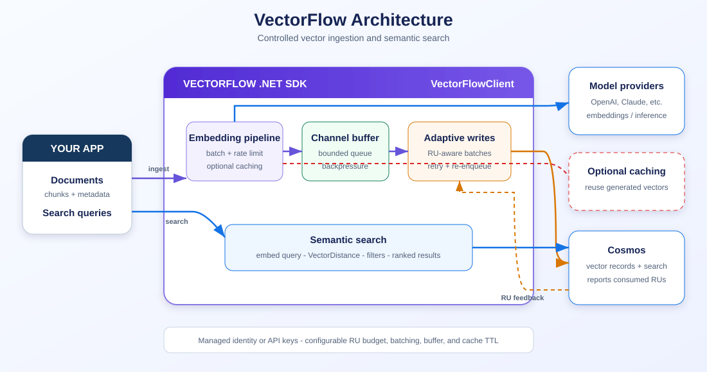

# VectorFlow SDK

**VectorFlow** is a .NET SDK that ingests text, generates embeddings via OpenAI, writes vector records to Cosmos in adaptive micro-batches, and performs semantic search — ensuring live user read queries are never degraded by write pressure.

## The Problem

When building AI-powered document search applications on Cosmos, developers face a fundamental challenge: **vector ingestion competes with user queries for the same RU budget.**

A typical scenario:
- A user uploads a 200-page PDF → needs to be chunked, embedded, and written to Cosmos
- Meanwhile, other users are actively searching their documents
- Naïve bulk writes consume all available RUs → search queries get throttled (HTTP 429)
- Users experience degraded search performance every time someone uploads a file

Existing solutions (LangChain, Semantic Kernel, LlamaIndex) treat writes as fire-and-forget — they offer no mechanism to control write throughput relative to a shared RU budget.

## How VectorFlow Solves This

VectorFlow introduces an **adaptive write engine** that acts like cruise control between your application and Cosmos:

```
Your App                    VectorFlow                         Services
────────                    ──────────                         ────────
IngestAsync() ──→ [Buffer] ──→ [Embed] ──→ [Schedule] ──→ [Write] ──→ Cosmos
     ↑               │                        ↑    │                      │
  returns          bounded                  EWMA   └─── delay ───┐       │
 immediately     backpressure             feedback                │       │
                                              └──── actual RU cost ──────┘
```

The scheduler **observes real-time RU costs** from every write, adjusts batch sizes and timing using exponential smoothing (EWMA), and guarantees your write operations never exceed a configurable budget — leaving the rest of your RUs free for search queries.

## Key Capabilities

| Capability | What it does | Why it matters |
|-----------|-------------|----------------|
| **Adaptive Scheduling** | Adjusts write batch size & timing based on observed RU costs | Search queries stay fast during bulk ingestion |
| **RU Budget Control** | Enforces a ceiling on write RU/s consumption | Predictable costs, no throttling surprises |
| **Backpressure Buffering** | Bounded async channel with automatic flow control | No OOM risk, no thread blocking |
| **Batched Embeddings** | Groups up to 100 texts per API call | 99% fewer network round-trips |
| **Optional Embedding Cache** | Caches vectors for identical text | Re-uploads cost zero, common text embedded once |
| **Semantic Search** | Vector similarity with partition/document filtering | Full read+write lifecycle in one SDK |
| **Silent Retry** | Failed writes re-enqueue automatically | No data loss without complex error handling |

## What Makes VectorFlow Different

Unlike RAG frameworks that focus on orchestrating LLM conversations, VectorFlow focuses on the **data plane** — getting vectors into and out of your database efficiently and safely:

| | LangChain | Semantic Kernel | LlamaIndex | **VectorFlow** |
|--|-----------|----------------|------------|--------------|
| Adaptive write scheduling | ❌ | ❌ | ❌ | ✅ |
| RU budget isolation | ❌ | ❌ | ❌ | ✅ |
| Backpressure-aware buffering | ❌ | ❌ | ❌ | ✅ |
| Embedding deduplication cache | ❌ | ❌ | ❌ | ✅ |
| Auto-retry with re-enqueue | ❌ | Partial | ❌ | ✅ |
| Cosmos native vector search | ❌ | ✅ | ❌ | ✅ |
| LLM/RAG orchestration | ✅ | ✅ | ✅ | ❌ (not the goal) |

**VectorFlow is not a RAG framework** — it's a purpose-built ingestion and search engine for Cosmos workloads where cost control, read/write isolation, and throughput optimization matter.

## Why VectorFlow?

- **Memory-buffered ingestion** — callers return immediately, no blocking
- **Adaptive micro-batch scheduling** — respects a configurable RU budget using EWMA-based feedback
- **Batched embedding generation** — up to 100 texts per OpenAI call
- **Optional embedding caching** — eliminates redundant embedding calls for duplicate text
- **Semantic search** — vector similarity search with filtering by user, document, or score threshold
- **Opaque API** — one client, one options class, no internal plumbing exposed

## Quick Start

```csharp
using VectorFlow;

services.AddVectorFlow(options =>
{
    // Cosmos
    options.CosmosEndpoint = "https://your-cosmos-endpoint/";
    options.CosmosDatabase = "mydb";
    options.CosmosContainer = "vectors";

    // OpenAI
    options.OpenAIEndpoint = "https://your-openai-endpoint/";
    options.OpenAIDeployment = "text-embedding-ada-002";

    // Optional embedding cache
    options.RedisConnectionString = "your-cache-connection-string";

    // Optional: tuning
    options.WriteRuBudgetPerSecond = 400;
});
```

Then inject and use:

```csharp
public class DocumentProcessor(VectorFlowClient vectorFlow)
{
    public async Task ProcessAsync(string docId, string userId, List<string> chunks)
    {
        await vectorFlow.IngestAsync(docId, userId, chunks);
    }
}
```

## Semantic Search

Search ingested documents by meaning, not just keywords:

```csharp
// Basic search — returns top 10 most relevant chunks
var results = await vectorFlow.SearchAsync("quarterly revenue trends");

// Filtered search with options
var results = await vectorFlow.SearchAsync("budget reports", new SearchOptions
{
    TopK = 5,                      // top 5 results
    ScoreThreshold = 0.7,          // only ≥70% similarity
    PartitionKey = "user-42",      // scope to a specific user's files
    DocumentId = "doc-abc-123"     // scope to a specific document
});

foreach (var r in results)
{
    Console.WriteLine($"[{r.Score:P0}] {r.DocumentId} (chunk {r.ChunkIndex}): {r.Text[..80]}...");
}
```

### How it works
1. Embeds your query using the same OpenAI model used for ingestion
2. Runs a Cosmos `VectorDistance` query against the DiskANN index
3. Filters by partition key / document ID if specified
4. Returns ranked results above the score threshold

## Authentication

Supports three patterns:

| Method | Config |
|--------|--------|
| **Token credential** (default) | Set `options.Credential` or omit to use the default credential chain |
| **API Keys** | `options.CosmosKey = "..."` and/or `options.OpenAIKey = "..."` |
| **Mixed** | Token credential for one service, API key for the other |

API keys take priority when set for a specific service.

## Architecture



The diagram separates the buffered ingestion path from semantic search and shows the
RU-cost feedback loop that controls write pressure. See the
[detailed architecture notes](docs/architecture.md) for a step-by-step description.

All internal components are `internal` — consumers only interact with `VectorFlowClient` and `VectorFlowOptions`.

## Publishing

NuGet packages are published automatically when a GitHub Release is published with a
SemVer tag such as `v0.1.0-beta.1` or `v1.0.0`.

One-time repository setup:

1. Add a GitHub repository variable named `NUGET_USER` containing your NuGet.org username.
2. On NuGet.org, create a Trusted Publishing policy for owner `ajtiwari07`, repository
   `VectorFlow`, and workflow file `publish-nuget.yml`.
3. Publish a GitHub Release. The workflow tests, packs, and publishes the tag version.

The initial release should use a prerelease tag while VectorFlow depends on a prerelease
OpenAI client library.

## Configuration

| Option | Default | Description |
|--------|---------|-------------|
| `CosmosEndpoint` | required | Cosmos account endpoint |
| `CosmosDatabase` | required | Database name |
| `CosmosContainer` | required | Container for vector records |
| `OpenAIEndpoint` | required | OpenAI endpoint |
| `OpenAIDeployment` | required | Embedding model deployment |
| `EmbeddingDimensions` | 1536 | Vector dimensions |
| `Credential` | Default credential chain | Token credential for both services |
| `CosmosKey` | null | Cosmos account key (overrides Credential) |
| `OpenAIKey` | null | OpenAI API key (overrides Credential) |
| `RedisConnectionString` | null | Enables embedding cache if set |
| `RedisCacheTtl` | 24h | Cache expiry for embeddings |
| `WriteRuBudgetPerSecond` | 400 | Max RU/s for writes |
| `EstimatedRuPerWrite` | 30 | Initial RU estimate (auto-adjusts) |
| `BufferCapacity` | 10,000 | Max records buffered before backpressure |
| `MaxEmbeddingBatchSize` | 100 | Texts per embedding API call |
| `MaxConcurrentEmbeddingCalls` | 3 | Parallel embedding requests |
| `MinFlushInterval` | 500ms | Minimum time between writes |
| `MaxFlushInterval` | 10s | Maximum time between writes |
| `EnableSearch` | true | Enable/disable semantic search capability |

## Benchmark Results

### Performance Comparison: Naive vs VectorFlow

Tested with simulated services matching real-world latencies (150ms per embedding API call, 10ms per Cosmos write, 30 RU per vector upsert):

| Document Size | Chunks | Naive (Sequential) | VectorFlow | Speedup |
|---------------|--------|-------------------|------------|---------|
| Small (~20K tokens) | 50 | 8.8s | 5.1s | **1.7x** |
| Medium (~80K tokens) | 200 | 35.0s | 18.9s | **1.9x** |
| Large (~200K tokens) | 500 | 86.7s | 47.0s | **1.8x** |
| XL (~400K tokens) | 1000 | ~173s | ~94s | **~1.8x** |

### Key Improvements

| Metric | Naive | VectorFlow | Improvement |
|--------|-------|------------|-------------|
| **Embedding API calls** (500 chunks) | 500 calls | 5 calls | **99% fewer** |
| **Write operations** (500 chunks) | 500 individual | 83 batches | **83% fewer** |
| **Avg latency per chunk** | 173ms | 94ms | **46% lower** |
| **RU burst pattern** | Constant, blocks reads longer | Controlled within budget | **Read-safe** |

### Cost Impact

| Scenario | Without VectorFlow | With VectorFlow | Savings |
|----------|--------------------|-----------------|---------|
| 500-chunk ingestion (API calls) | 500 network round-trips | 5 network round-trips | 99% latency reduction |
| Re-upload same document (with cache) | Full re-embedding cost | 0 API calls | **100% embedding cost eliminated** |
| Concurrent users searching during ingestion | Search queries throttled (RU contention) | Searches unaffected (budget-controlled writes) | **Zero read degradation** |

### When VectorFlow Shines Most

- **Large documents** (100+ chunks): 99% fewer API calls, ~1.8x faster
- **Concurrent workloads**: Scheduler prevents write RU spikes from impacting search queries
- **Retry/re-upload scenarios**: Optional caching eliminates redundant embedding costs
- **Serverless Cosmos**: RU budget control prevents 429 throttling
- **Batch migrations**: Controlled throughput without burning provisioned capacity

See [docs/benchmark-results.md](docs/benchmark-results.md) for full methodology and detailed analysis.

## Project Structure

```
VectorFlow/
├── src/VectorFlow/          # SDK source
│   ├── Buffering/           # ChannelBuffer (bounded async queue)
│   ├── Embedding/           # OpenAI + optional cache
│   ├── Scheduling/          # Adaptive write scheduler (EWMA)
│   ├── Search/              # Semantic vector search
│   ├── Writing/             # Cosmos batch writer
│   ├── VectorFlowClient.cs  # Public entry point
│   ├── VectorFlowOptions.cs # Public configuration
│   └── VectorFlowServiceExtensions.cs  # DI helper
├── tests/VectorFlow.Benchmarks/  # Performance benchmarks
├── docs/                    # Detailed documentation
└── README.md
```

## Running Benchmarks

```bash
dotnet run --project tests/VectorFlow.Benchmarks
```

No cloud credentials required — uses simulated services with realistic latencies.

## License

MIT
